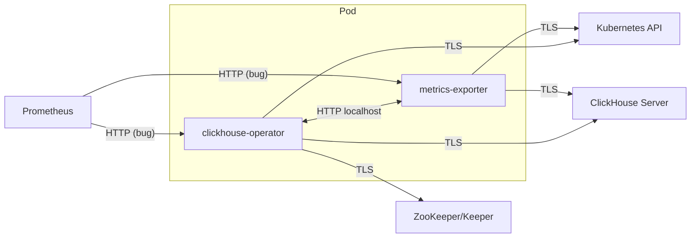

# QA-STP FIPS 140-3 Compatibility
# Software Test Plan

(c) 2026 Altinity Inc. All Rights Reserved.

**Author:** vzakaznikov

**Date:** May 19, 2026

## Table of Contents

* 1 [Introduction](#introduction)
* 2 [Configuration Requirements](#configuration-requirements)
* 3 [Build Verification](#build-verification)
* 4 [GODEBUG Strict Mode Smoke Test](#godebug-strict-mode-smoke-test)
* 5 [FIPS 140-3 Valid TLS Cipher Suites](#fips-140-3-valid-tls-cipher-suites)
* 6 [ClickHouse Server and Keeper FIPS Configurations](#clickhouse-server-and-keeper-fips-configurations)
* 7 [FIPS Enforcement Mode](#fips-enforcement-mode)
* 8 [clickhouse-operator Connections](#clickhouse-operator-connections)
* 9 [metrics-exporter Connections](#metrics-exporter-connections)
* 10 [Integrity Check Failure](#integrity-check-failure)
* 11 [CAST Failure](#cast-failure)
* 12 [Synthetic TLS Cipher Validation](#synthetic-tls-cipher-validation)
* 13 [CI/CD Image and Policy Verification](#cicd-image-and-policy-verification)
* 14 [(Optional) ACVP Algorithm Validation](#optional-acvp-algorithm-validation)

## Introduction

This test plan covers FIPS 140-3 compatibility testing for the **clickhouse-operator** and
**metrics-exporter** binaries built with Go FIPS support.

The goal is to verify that FIPS-enabled builds of the operator and metrics-exporter:
- Operate correctly under FIPS constraints
- Properly enforce cryptographic restrictions
- Use FIPS-compliant TLS for all inbound and outbound connections

**Boundary:** The operator and metrics-exporter run in the same pod. Internal IPC between them
is localhost HTTP and is not subject to FIPS TLS requirements.



## Configuration Requirements

Plain HTTP/TCP on any external connection is a configuration error for FIPS compliance.
TLS must be enabled for all connections to:

- Kubernetes API
- ClickHouse Server
- ZooKeeper/Keeper
- Prometheus scrape endpoints

## Build Verification

**Objective:** Verify binaries are FIPS builds and linked to Go Cryptographic Module v1.0.0.

**Certificates:**
- [CMVP #5247](https://csrc.nist.gov/projects/cryptographic-module-validation-program/certificate/5247)
- [CAVP A6650](https://csrc.nist.gov/projects/cryptographic-algorithm-validation-program/details?product=19371)

**Build requirement:** `GOFIPS140=v1.0.0` (or `certified`)

| Test Assertion | Description | Expected Result |
|----------------|-------------|-----------------|
| Operator version | Run `clickhouse-operator --version` or check logs | Output includes FIPS indicator |
| Metrics exporter version | Run `metrics-exporter --version` or check logs | Output includes FIPS indicator |
| Build flag | Run `go version -m <binary>` | Shows `GOFIPS140=v1.0.0` |
| FIPS version | Check `crypto/fips140.Version()` | Returns `v1.0.0` |
| FIPS enabled | Check `crypto/fips140.Enabled()` | Returns `true` |

## GODEBUG Strict Mode Smoke Test

**Objective:** Verify the project test suite runs in strict FIPS mode.

| Test Assertion | Description | Expected Result |
|----------------|-------------|-----------------|
| Strict mode smoke test | Run all e2e tests with `GODEBUG=fips140=only` enabled | No panic/crash and no test regressions caused by strict FIPS mode |

## FIPS 140-3 Valid TLS Cipher Suites

The following cipher suites are valid for this test plan and apply to all TLS-enabled
inbound and outbound connections for both clickhouse-operator and metrics-exporter.

### Approved TLS Cipher Suites (Used by Both Clients and Servers)

**TLS 1.2:**

| Cipher Suite | OpenSSL Name |
|--------------|--------------|
| TLS_ECDHE_RSA_WITH_AES_128_GCM_SHA256 | ECDHE-RSA-AES128-GCM-SHA256 |
| TLS_ECDHE_RSA_WITH_AES_256_GCM_SHA384 | ECDHE-RSA-AES256-GCM-SHA384 |
| TLS_ECDHE_ECDSA_WITH_AES_128_GCM_SHA256 | ECDHE-ECDSA-AES128-GCM-SHA256 |
| TLS_ECDHE_ECDSA_WITH_AES_256_GCM_SHA384 | ECDHE-ECDSA-AES256-GCM-SHA384 |
| TLS_DHE_RSA_WITH_AES_128_GCM_SHA256 | DHE-RSA-AES128-GCM-SHA256 |
| TLS_DHE_RSA_WITH_AES_256_GCM_SHA384 | DHE-RSA-AES256-GCM-SHA384 |
| TLS_RSA_WITH_AES_128_GCM_SHA256 | AES128-GCM-SHA256 |
| TLS_RSA_WITH_AES_256_GCM_SHA384 | AES256-GCM-SHA384 |

**TLS 1.3:**

| Cipher Suite | OpenSSL Name |
|--------------|--------------|
| TLS_AES_128_GCM_SHA256 | TLS_AES_128_GCM_SHA256 |
| TLS_AES_256_GCM_SHA384 | TLS_AES_256_GCM_SHA384 |
| TLS_AES_128_CCM_SHA256 | TLS_AES_128_CCM_SHA256 |
| TLS_AES_128_CCM_8_SHA256 | TLS_AES_128_CCM_8_SHA256 |

**Not valid for this test plan (must be rejected):**
- Any TLS cipher suite not explicitly listed in the approved TLS 1.2/TLS 1.3 tables above
- Protocol versions: SSLv2, SSLv3, TLS 1.0, TLS 1.1
- Cipher suites using non-approved/legacy algorithms (for this profile), including:
  - ChaCha20-Poly1305
  - RC4, RC2, DES, 3DES, IDEA, SEED, CAMELLIA, ARIA
  - NULL encryption / NULL authentication
  - Anonymous key exchange (`aNULL`, `eNULL`, `ADH`, `AECDH`)
  - Export/weak suites (`EXP`, `LOW`, `40-bit`, `56-bit`)
  - MD5- or SHA-1-based legacy suites

## ClickHouse Server and Keeper FIPS Configurations

**Objective:** Verify operator generates and maintains FIPS-compliant configurations for ClickHouse servers and Keepers.

**ClickHouse Server:**

| Test Assertion | Description | Expected Result |
|----------------|-------------|-----------------|
| FIPS config applied | Deploy CHI with FIPS TLS settings | ClickHouse starts with FIPS-compliant TLS |
| No plain HTTP port | Verify HTTP port (8123) disabled when FIPS enforced | Only HTTPS port (8443) listening |
| No plain TCP port | Verify native TCP port (9000) disabled when FIPS enforced | Only secure TCP port (9440) listening |
| No unexpected ports | Verify no other inbound/outbound ports opened | Only expected secure ports listening |
| Internode TLS | Verify interserver_https_port configured | Replicas communicate over TLS |
| Scale up | Add replica to FIPS-configured cluster | New replica has FIPS config |
| Scale down | Remove replica from FIPS-configured cluster | Remaining replicas keep FIPS config |
| Config update | Update TLS settings on running CHI | ClickHouse reloads with new FIPS config |

**ClickHouse Keeper:**

| Test Assertion | Description | Expected Result |
|----------------|-------------|-----------------|
| FIPS config applied | Deploy CHK with FIPS TLS settings | Keeper starts with FIPS-compliant TLS |
| No plain client port | Verify client port (2181) disabled when FIPS enforced | Only secure client port (2281) listening |
| No unexpected ports | Verify no other inbound/outbound ports opened | Only expected secure ports listening |
| Raft TLS | Verify Raft port uses TLS | Keeper nodes communicate over TLS |
| Scale up | Add node to FIPS-configured Keeper cluster | New node has FIPS config |
| Scale down | Remove node from FIPS-configured Keeper cluster | Remaining nodes keep FIPS config |
| Config update | Update TLS settings on running CHK | Keeper reloads with new FIPS config |

## FIPS Enforcement Mode

**Objective:** Verify `security.fips.enforced=true` coerces security settings and rejects non-compliant configurations.

**Security Coercion (`security.fips.enforced=true`):**

| Test Assertion | Description | Expected Result |
|----------------|-------------|-----------------|
| Coerce verify to Strict | Deploy with `fips.enforced=true` and no verify set | ClickHouse/ZK/K8s TLS verify coerced to Strict |
| Coerce minVersion to 1.3 | Deploy with `fips.enforced=true` and no minVersion set | ClickHouse/ZK/K8s TLS minVersion coerced to 1.3 |
| Coerce IPC mode to Secure | Deploy with `fips.enforced=true` and no IPC mode set | `security.ipc.mode` coerced to Secure |
| Reject insecure kubeconfig at startup | Kubeconfig has `TLSClientConfig.Insecure=true` under strict/FIPS mode | Operator refuses to start |
| Reject verify=None | CHI with `clickhouse.tls.verify=None` under enforced mode | CHI rejected with FIPSValidationFailed |
| Reject ZK verify=None | CHI with `zookeeper.tls.verify=None` under enforced mode | CHI rejected with FIPSValidationFailed |
| Reject invalid minVersion | CHI with invalid minVersion under enforced mode | CHI rejected with FIPSValidationFailed |
| Reject external ZooKeeper | CHI references plain ZK nodes under enforced mode | CHI rejected with FIPSValidationFailed |
| Reject CHK TLS bypass | CHK with `clickhouse.tls.verify=None` under enforced mode | CHK rejected with FIPSValidationFailed |

**Image Policy (`security.fips.images.policy`):**

| Test Assertion | Description | Expected Result |
|----------------|-------------|-----------------|
| Required + non-fips image | CHI with image lacking "fips" tag | CHI rejected with FIPSImagePolicyViolation |
| Required + fips image | CHI with image containing "fips" tag | CHI reconciles normally |
| Required + non-fips Keeper image | CHK with image lacking "fips" tag | CHK rejected with FIPSImagePolicyViolation |
| Required + version check | Host `SELECT version()` lacks "fips" | Host marked failed, FIPSImagePolicyViolation |
| Permissive + non-fips | CHI with any image | CHI reconciles (default behavior) |
| Multiple hosts violation | CHI with multiple non-fips hosts | Single error, short-circuits at first |

**Image Tag Detection:**

| Test Assertion | Description | Expected Result |
|----------------|-------------|-----------------|
| Tag with "fips" suffix | `altinity/clickhouse-server:25.3.fips` | Detected as FIPS |
| Tag with "altinityfips" | `altinity/clickhouse-server:25.3.8.30001.altinityfips` | Detected as FIPS |
| Case insensitive | `...:25.3.FIPS` or `...:25.3.Fips` | Detected as FIPS |
| Digest-only reference | `repo@sha256:...` | Not detected (no tag) |
| Registry with "fips" in path | `fips-registry.example.com/image:latest` | Not detected (tag only) |

## clickhouse-operator Connections

**Objective:** Verify all clickhouse-operator inbound and outbound connections use FIPS-compliant TLS.

**Connection Overview:**

| Direction | Target | Protocol | Default Port | TLS Support |
|-----------|--------|----------|--------------|-------------|
| Outbound | Kubernetes API Server | HTTPS | 443 | Yes (client-go), configurable via `security.kubernetes.tls` |
| Outbound | ClickHouse Server | HTTP/HTTPS | 8123/8443 | Yes, configurable via `security.clickhouse.tls` |
| Outbound | ZooKeeper/Keeper | TCP | 2181/2281 | Yes (mTLS), configurable via `security.zookeeper.tls` |
| Outbound | metrics-exporter (IPC) | HTTP | 8888 | No (same pod, localhost) |
| Inbound | Prometheus scrape | HTTP | 9999 | **FIPS Gap** - needs TLS |

**Operator to Kubernetes API**

| Test Assertion | Description | Expected Result |
|----------------|-------------|-----------------|
| Operator FIPS cipher to K8s | Operator connects with FIPS-approved cipher | Connection succeeds |
| Operator non-FIPS cipher to K8s | K8s API only offers non-approved cipher | Operator rejects connection |
| `security.kubernetes.tls.minVersion=1.2` | Enforce TLS 1.2 minimum | TLS 1.1 rejected |
| `security.kubernetes.tls.minVersion=1.3` | Enforce TLS 1.3 minimum | TLS 1.2 rejected |

**Operator to ClickHouse Server**

| Test Assertion | Description | Expected Result |
|----------------|-------------|-----------------|
| Operator FIPS cipher to CH | Operator connects with FIPS-approved cipher | Connection succeeds |
| Operator non-FIPS cipher to CH | Server only offers non-approved cipher | Operator rejects connection |
| `security.clickhouse.tls.minVersion=1.2` | Enforce TLS 1.2 minimum | TLS 1.1 rejected |
| `security.clickhouse.tls.minVersion=1.3` | Enforce TLS 1.3 minimum | TLS 1.2 rejected |

**Operator to ZooKeeper/Keeper**

| Test Assertion | Description | Expected Result |
|----------------|-------------|-----------------|
| Operator FIPS cipher to ZK | Operator connects with FIPS-approved cipher | Connection succeeds |
| Operator non-FIPS cipher to ZK | ZK only offers non-approved cipher | Operator rejects connection |
| `security.zookeeper.tls.minVersion=1.2` | Enforce TLS 1.2 minimum | TLS 1.1 rejected |
| `security.zookeeper.tls.minVersion=1.3` | Enforce TLS 1.3 minimum | TLS 1.2 rejected |

**Operator to metrics-exporter (IPC)**

> Same pod, localhost - HTTP acceptable. Token auth via `security.ipc.mode=Secure`.

| Test Assertion | Description | Expected Result |
|----------------|-------------|-----------------|
| Operator IPC + `security.ipc.mode=Secure` | HTTP with token auth enabled | Works correctly |

**Operator Prometheus Metrics (:9999)**

> **FIPS Gap:** Currently HTTP-only. TLS implementation required for FIPS compliance.

| Test Assertion | Description | Expected Result |
|----------------|-------------|-----------------|
| Operator metrics TLS enabled | Verify TLS listener on :9999 | TLS handshake succeeds |
| Operator metrics FIPS cipher | Scrape with FIPS-approved cipher | Connection succeeds |
| Operator metrics non-FIPS cipher | Scrape with non-approved cipher | Connection rejected |

## metrics-exporter Connections

**Objective:** Verify all metrics-exporter inbound and outbound connections use FIPS-compliant TLS.

**Connection Overview:**

| Direction | Target | Protocol | Default Port | TLS Support |
|-----------|--------|----------|--------------|-------------|
| Outbound | Kubernetes API Server | HTTPS | 443 | Yes (client-go) |
| Outbound | ClickHouse Server | HTTP/HTTPS | 8123/8443 | Yes, inherits from `chop.Config()` |
| Inbound | Prometheus scrape | HTTP | 8888 `/metrics` | **FIPS Gap** - needs TLS |
| Inbound | Operator IPC | HTTP | 8888 `/chi` | No (same pod, localhost) |

**Exporter to Kubernetes API**

> Uses client-go defaults. No minVersion control exposed.

| Test Assertion | Description | Expected Result |
|----------------|-------------|-----------------|
| Exporter FIPS cipher to K8s | Exporter connects with FIPS-approved cipher | Connection succeeds |
| Exporter non-FIPS cipher to K8s | K8s API only offers non-approved cipher | Exporter rejects connection |

**Exporter to ClickHouse Server**

> TLS supported via `chop.Config()`, but `ChSchemeAuto` prefers HTTP if both ports available.
> Must configure `scheme: https` explicitly for FIPS compliance.

| Test Assertion | Description | Expected Result |
|----------------|-------------|-----------------|
| Exporter FIPS cipher to CH | Exporter queries with FIPS-approved cipher | Connection succeeds |
| Exporter non-FIPS cipher to CH | Server only offers non-approved cipher | Exporter rejects connection |

**Exporter Prometheus Metrics (:8888/metrics)**

> **FIPS Gap:** Currently HTTP-only. TLS implementation required for FIPS compliance.

| Test Assertion | Description | Expected Result |
|----------------|-------------|-----------------|
| Exporter metrics TLS enabled | Verify TLS listener on :8888 | TLS handshake succeeds |
| Exporter metrics FIPS cipher | Scrape with FIPS-approved cipher | Connection succeeds |
| Exporter metrics non-FIPS cipher | Scrape with non-approved cipher | Connection rejected |

**Exporter IPC Endpoint (:8888/chi)**

> Covered by Operator IPC tests above. Same pod, localhost.

## Integrity Check Failure

**Objective:** Verify FIPS integrity self-test detects binary tampering.

| Test Assertion | Description | Expected Result |
|----------------|-------------|-----------------|
| Corrupted binary | XOR byte in `.go.fipsinfo` section and execute | Panic: `fips140: verification mismatch` |

**Procedure:**

Flip one byte in the `.go.fipsinfo` embedded HMAC to trigger integrity check failure at init:

1. Locate `.go.fipsinfo` section offset: `readelf -S -W <binary>`
2. XOR byte at offset+16 (first byte of 32-byte HMAC after 16-byte magic)
3. Run tampered binary - expect panic: `fips140: verification mismatch`

Requires: `readelf` (binutils), `python3`

## CAST Failure

**Objective:** Verify FIPS Cryptographic Algorithm Self-Test (CAST) detects failures.

| Test Assertion | Description | Expected Result |
|----------------|-------------|-----------------|
| CAST failure | Trigger known-answer test failure via `GODEBUG=failfipscast=<name>` | Process terminates with CAST error |

**Procedure:**

Use `GODEBUG=failfipscast=<name>` to simulate CAST failures.

Available CAST names: see `$GOROOT/src/crypto/internal/fips140test/cast_test.go` (`allCASTs` variable).

## Synthetic TLS Cipher Validation

**Objective:** Validate FIPS cipher enforcement on all external (to the pod) connections (see [diagram](#introduction)) using `openssl s_client` and `openssl s_server`.

**Procedure:**

Use `openssl` to simulate connections with specific ciphers and verify the operator/exporter
accepts FIPS-approved ciphers and rejects non-approved ones.

```bash
# Example: Test operator as TLS client against server offering only approved cipher
openssl s_server -accept 8443 -cert server.crt -key server.key \
  -ciphersuites TLS_AES_256_GCM_SHA384

# Example: Test operator as TLS client against server offering non-approved cipher  
openssl s_server -accept 8443 -cert server.crt -key server.key \
  -cipher ECDHE-RSA-CHACHA20-POLY1305

# Example: Test inbound connection to operator/exporter metrics endpoint
openssl s_client -connect localhost:9999 -cipher ECDHE-RSA-AES256-GCM-SHA384
```

**Test Matrix:**

| Connection | Role | Tool | Test |
|------------|------|------|------|
| Operator to K8s API | Client | `openssl s_server` | Each approved cipher succeeds |
| Operator to K8s API | Client | `openssl s_server` | Each non-approved cipher rejected |
| Operator to ClickHouse | Client | `openssl s_server` | Each approved cipher succeeds |
| Operator to ClickHouse | Client | `openssl s_server` | Each non-approved cipher rejected |
| Operator to ZK/Keeper | Client | `openssl s_server` | Each approved cipher succeeds |
| Operator to ZK/Keeper | Client | `openssl s_server` | Each non-approved cipher rejected |
| Operator metrics :9999 | Server | `openssl s_client` | Each approved cipher succeeds |
| Operator metrics :9999 | Server | `openssl s_client` | Each non-approved cipher rejected |
| Exporter to K8s API | Client | `openssl s_server` | Each approved cipher succeeds |
| Exporter to K8s API | Client | `openssl s_server` | Each non-approved cipher rejected |
| Exporter to ClickHouse | Client | `openssl s_server` | Each approved cipher succeeds |
| Exporter to ClickHouse | Client | `openssl s_server` | Each non-approved cipher rejected |
| Exporter metrics :8888 | Server | `openssl s_client` | Each approved cipher succeeds |
| Exporter metrics :8888 | Server | `openssl s_client` | Each non-approved cipher rejected |

See [FIPS 140-3 Valid TLS Cipher Suites](#fips-140-3-valid-tls-cipher-suites) for approved and non-approved cipher lists.

## CI/CD Image and Policy Verification

**Objective:** Add CI/CD jobs to validate FIPS image build and supply-chain checks.

| Test Assertion | Description | Expected Result |
|----------------|-------------|-----------------|
| Operator FIPS image build | Build clickhouse-operator with FIPS tags | Image builds successfully |
| Exporter FIPS image build | Build metrics-exporter with FIPS tags | Image builds successfully |
| Image vulnerability scan | Scan images with Grype | No Critical, High, or Medium vulnerabilities |

> **Note:** Image policy enforcement tests covered in [FIPS Enforcement Mode](#fips-enforcement-mode).

## (Optional) ACVP Algorithm Validation

**Objective:** Reproduce ACVP expected-output checks using the same public-scope config
pattern used in [clickhouse-backup PR #1364](https://github.com/Altinity/clickhouse-backup/pull/1364).

> **Note:** ACVP tests the cryptographic library as compiled into the shipped binary.
> In Go, crypto primitives are statically linked — the bytes ACVP exercises are the exact bytes users run.
> Reference config:
> [`pkg/acvpwrapper/acvp_test_fips140v1.26.public.config.json`](https://github.com/Altinity/clickhouse-backup/blob/master/pkg/acvpwrapper/acvp_test_fips140v1.26.public.config.json)
> (public-API scope; excludes ML-KEM/ML-DSA).

| Test Assertion | Description | Expected Result |
|----------------|-------------|-----------------|
| ACVP wrapper integration | Add `acvp` subcommand to operator/exporter | ACVP subcommand responds |
| ACVP config generation | Run `<binary> acvp getConfig` | Returns supported capabilities |
| ACVP expected-output replay | Run pinned ACVP replay against tracked config | All configured suites match expected output |
| ACVP suite count | Validate configured suite count from tracked config | `38 ACVP tests matched expectations` |

Covered suite families from the tracked config (38 total):
- SHA-2 (6), SHA-3 (4), SHAKE/cSHAKE (4)
- HMAC-SHA-2 (6), HMAC-SHA-3 (4)
- AES-CBC/CTR/GCM and CMAC-AES (4)
- KDA/PBKDF/KDF components (3), DRBG (2)
- ECDSA/EdDSA/RSA (3), TLS 1.2/1.3 (2)
